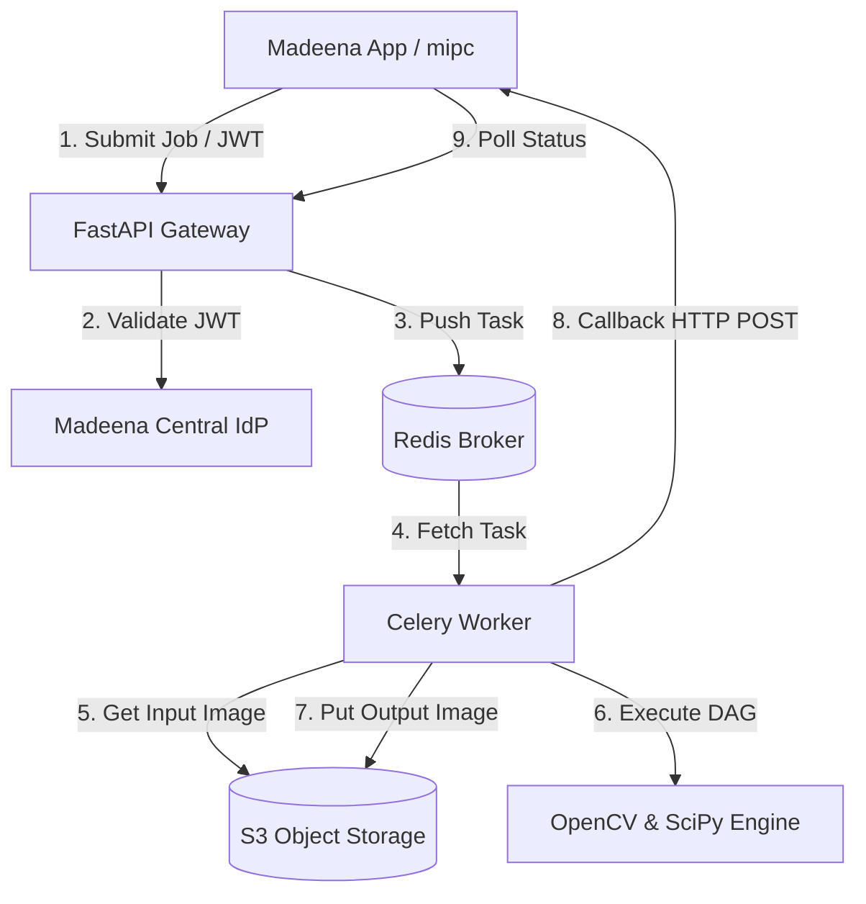

# PRD: Madeena Python Image Processing Service (mpips)

## Product Overview

**Madeena Python Image Processing Service (mpips)** is a high-performance, centralized backend service responsible for scientific and utility image-processing execution across the entire Madeena product suite. This includes the Laravel Filament Image Pipeline Platform (`mipc`) and other Madeena mobile and web applications.

`mpips` exposes a versioned, secure REST API built on FastAPI and utilizes a Celery task queue backed by Redis to manage long-running execution workloads asynchronously. It acts as the execution plane, processing image transformation Directed Acyclic Graphs (DAGs) on images stored in S3-compatible object storage.

---

## Goals And Non-Goals

### Goals
- **High-Performance Execution**: Perform fast computer vision and scientific operations on images using OpenCV, scikit-image, NumPy, and SciPy.
- **Asynchronous Task Orchestration**: Offload long-running image operations to Celery workers so API endpoints remain responsive.
- **Dynamic DAG Interpretation**: Parse, validate, and execute arbitrary user-defined Directed Acyclic Graphs (DAGs) in topological order.
- **Scalable Architecture**: Design workers to scale horizontally to handle concurrent load from all Madeena products.
- **Secure by Default**: Validate and secure all API requests using OAuth2 Client Credentials flow with JWT authentication from Madeena's central Identity Provider (IdP).
- **Dynamic Node Catalog**: Automatically generate and serve the available processor node schema (`GET /v1/nodes`) dynamically using declarative Python/Pydantic classes.
- **Direct Object Storage Integration**: Streamline data transfer by reading and writing files directly to S3-compatible storage using bucket keys or signed URLs.
- **Progress Tracking & Webhooks**: Provide API polling endpoints and reliable webhook callbacks to notify calling applications of task state changes.

### Non-Goals
- No persistent storage of application metadata (e.g., user profiles, tenant memberships, pricing/billing), which remains the responsibility of the calling client apps (e.g., `mipc`).
- No user interface or visual builder canvas (handled by front-end client services).
- No direct image serving for end-users (images are uploaded/downloaded directly from S3 or via signed URLs generated by the client apps).

---

## Target Clients
- **Laravel Filament Image Pipeline (`mipc`)**: Composes graphs visually and submits pipeline runs.
- **Madeena Mobile and Web Apps**: Connect directly to perform quick filters, image enhancement, or image quality assessments (IQA).
- **Internal Research & Development**: Python tools and scripts that invoke the service API to test new scientific algorithms.

---

## System Architecture



---

## REST API Specification

All endpoints are versioned under `/v1` and require an `Authorization: Bearer <JWT>` header unless specified.

### 1. `GET /v1/nodes`
Returns the dynamic catalog of available image processing nodes, their descriptions, input/output structures, and configurable parameters.

#### Response Example
```json
{
  "nodes": [
    {
      "id": "grayscale",
      "name": "Grayscale Conversion",
      "category": "adjustments",
      "description": "Convert an image to grayscale using OpenCV.",
      "inputs": [{"name": "input_image", "type": "image"}],
      "outputs": [{"name": "output_image", "type": "image"}],
      "parameters": [],
      "version": "1.0.0"
    },
    {
      "id": "resize",
      "name": "Resize Image",
      "category": "geometry",
      "description": "Resize an image to specific dimensions.",
      "inputs": [{"name": "input_image", "type": "image"}],
      "outputs": [{"name": "output_image", "type": "image"}],
      "parameters": [
        {
          "name": "width",
          "type": "integer",
          "default": 800,
          "description": "Target width in pixels",
          "min": 1
        },
        {
          "name": "height",
          "type": "integer",
          "default": 600,
          "description": "Target height in pixels",
          "min": 1
        }
      ],
      "version": "1.0.0"
    }
  ]
}
```

### 2. `POST /v1/jobs`
Submits an image processing DAG execution job to the queue.

#### Request Schema (JSON)
- `external_execution_id` (string, UUID): The unique identifier from the calling system.
- `pipeline` (object):
  - `nodes` (array): List of operation nodes (with configuration parameters).
  - `edges` (array): Connectors detailing flow of data between nodes.
- `inputs` (object): Key-value pairs mapping input node IDs to S3 keys, signed URLs, or configuration.
- `output` (object): Contains target S3 write configuration (bucket, prefix, or signed write URLs).
- `callback_url` (string, optional): HTTP URL for status change notifications.

#### Request Example
```json
{
  "external_execution_id": "8fa3b7e4-0bb7-4b71-9252-c6c7b3be9851",
  "pipeline": {
    "nodes": [
      { "id": "input_1", "type": "input" },
      { "id": "blur_1", "type": "gaussian_blur", "parameters": { "kernel_size": 5 } },
      { "id": "output_1", "type": "output" }
    ],
    "edges": [
      { "source": "input_1", "target": "blur_1", "source_handle": "output_image", "target_handle": "input_image" },
      { "source": "blur_1", "target": "output_1", "source_handle": "output_image", "target_handle": "input_image" }
    ]
  },
  "inputs": {
    "input_1": {
      "source_type": "s3",
      "bucket": "madeena-media",
      "key": "tenants/t1/uploads/image.png"
    }
  },
  "output": {
    "destination_type": "s3",
    "bucket": "madeena-media",
    "prefix": "tenants/t1/outputs/8fa3b7e4/"
  },
  "callback_url": "https://mipc.madeena.com/api/v1/callbacks/jobs"
}
```

#### Response Example (202 Accepted)
```json
{
  "job_id": "job_9b1deb4d-3b7d-4bad-9bdd-2b0d7b3dcb6d",
  "status": "queued",
  "submitted_at": "2026-06-12T06:30:00Z"
}
```

### 3. `GET /v1/jobs/{id}`
Retrieves the status and metadata of a specific execution job.

#### Response Example
```json
{
  "job_id": "job_9b1deb4d-3b7d-4bad-9bdd-2b0d7b3dcb6d",
  "external_execution_id": "8fa3b7e4-0bb7-4b71-9252-c6c7b3be9851",
  "status": "running",
  "progress": 50.0,
  "current_node": "blur_1",
  "started_at": "2026-06-12T06:30:02Z",
  "finished_at": null,
  "outputs": {},
  "error": null
}
```

### 4. `DELETE /v1/jobs/{id}`
Aborts a running or queued job.

#### Response Example (200 OK)
```json
{
  "job_id": "job_9b1deb4d-3b7d-4bad-9bdd-2b0d7b3dcb6d",
  "status": "cancelled",
  "cancelled_at": "2026-06-12T06:31:00Z"
}
```

---

## Dynamic DAG Execution Model

`mpips` executes processing graphs dynamically using the following protocol:
1. **JSON Parsing**: The incoming JSON graph structure containing `nodes` and `edges` is parsed.
2. **Topological Sort**: The system constructs an adjacency list representation of the graph and executes Kahn's algorithm or Depth-First Search (DFS) to:
   - Identify circular references (cycles) and reject invalid graphs with `400 Bad Request`.
   - Compute a valid linear execution order (e.g., `[input_1] -> [blur_1] -> [output_1]`).
3. **Data Passing**: Each node takes inputs and produces outputs. The edges map output handles of upstream nodes to input handles of downstream nodes. A context dictionary tracks the state of computed tensors/images at each handle.
4. **Node Implementation**: Individual nodes map to dedicated execution classes that implement the specific OpenCV/scikit-image/scientific functions.

---

## Async Execution Lifecycle (Celery)

The execution of a job follows this strict pipeline:
1. **Queueing**: FastAPI receives `POST /v1/jobs`, validates the JSON structure against Pydantic models, publishes a Celery task, and immediately returns a `202 Accepted` status with the `job_id`.
2. **Worker Dequeue**: A Celery worker picks up the job. The job status is updated in Redis to `running`.
3. **Download Phase**: The worker downloads all input images from the S3 paths or signed URLs.
4. **Execution Phase**: The worker performs the topological sort and processes each node in sequence. It tracks progress percentage (e.g., `(completed_nodes / total_nodes) * 100`) and the current executing node, storing this status in Redis.
5. **Upload Phase**: The worker writes all output images and metadata back to S3.
6. **Notification (Webhook)**: Upon job completion or failure, the worker triggers an HTTP POST request to the caller's `callback_url` with the job's final status and details.
7. **Cleanup**: Temporary local files created by the worker are removed.

---

## Security Model

To maintain isolation and secure communication across the Madeena microservice landscape:
- **Authentication Protocol**: JWT validation based on OAuth2 Client Credentials flow.
- **Token Signature Validation**: The service retrieves the public keys (JWKS) from Madeena's central Identity Provider (IdP) and validates the token signature, expiration (`exp`), and issuer (`iss`).
- **Authorization Scopes**: Access requires specific scopes, e.g., `image:process` and `nodes:read`.
- **Tenant Isolation**: S3 directories are strictly separated by tenant identifiers. Client applications must include the tenant identifier in the metadata, and workers ensure read/write targets match the tenant context.
- **Simple Development Auth Mode**: To facilitate rapid local development and testing without requiring connections to the central IdP/SSO, mpips must support a mock/simple bypass. If configured via environment variables (e.g., `DEV_AUTH_BYPASS=true` and a designated `DEV_BEARER_TOKEN`), mpips will accept a static, shared developer token for request validation. This mock mode must be strictly disabled or compiled out in production.

---

## Image Processing Node Catalog (MVP)

Below is the list of nodes that must be supported in the initial version of `mpips`.

### 1. Core IO
- **Input Node**: Maps S3 source configurations into the DAG execution pipeline. Downloads file to memory or temporary local workspace.
- **Output Node**: Encapsulates S3 destination parameters. Uploads the final result image.

### 2. Geometry
- **Resize**: Resizes images based on `width`, `height`, and `interpolation` mode (`NEAREST`, `BILINEAR`, `BICUBIC`, `LANCZOS4`).
- **Crop**: Crops image relative to bounding box (`x_start`, `y_start`, `width`, `height`).
- **Rotate**: Rotates image by an arbitrary angle (`angle` in degrees, `expand` boolean).
- **Flip**: Flips image horizontally, vertically, or both.

### 3. Basic Adjustments
- **Grayscale Conversion**: Converts multi-channel RGB/RGBA images into single-channel luminance arrays.
- **Brightness & Contrast**: Adjusts brightness and contrast using linear scaling:
  \[I_{out}(x, y) = \alpha \cdot I_{in}(x, y) + \beta\]
- **Thresholding**: Converts image to binary using simple threshold (`threshold_value`) or Otsu's thresholding.
- **Gamma Correction**: Non-linear luminance correction using:
  \[I_{out}(x, y) = \left(\frac{I_{in}(x, y)}{255}\right)^\gamma \cdot 255\]

### 4. Basic Filtering
- **Gaussian Blur**: Smooths images to reduce noise using Gaussian filter (`kernel_size`, `sigma`).
- **Median Blur**: Non-linear blur using median filter (`kernel_size`), highly effective for salt-and-pepper noise.
- **Canny Edge Detection**: Detects edges using multi-stage hysteresis thresholding (`low_threshold`, `high_threshold`).
- **Sobel Filter**: Computes horizontal or vertical derivatives to extract gradients (`dx`, `dy`, `ksize`).

### 5. Advanced / Scientific
- **Non-Local Means (NLM) Denoising**: Smooths images based on patch similarity. Highly effective for low-light sensor noise.
- **Homomorphic Filter**: Frequency domain filter that separates illumination and reflectance. Used to correct non-uniform lighting and remove shadows.
- **Wavelet Denoising**: Multiscale image denoising using discrete wavelet transform (DWT), thresholding coefficients, and inverse transform.
- **Flat-Field Correction**: Corrects uneven sensor sensitivity and lens vignetting using:
  \[I_{corrected} = \frac{I_{raw} - I_{dark}}{I_{flat} - I_{dark}} \cdot m\]
- **Camera Calibration**: Supports correcting geometric lens distortion using camera matrices (`.npz` files storing camera matrix `K` and distortion coefficients `D`).
- **FABEMD (Fast Adaptive Bi-dimensional Empirical Mode Decomposition)**: Decomposes 2D images into Bidimensional Intrinsic Mode Functions (BIMFs) and a residue. Used for advanced scientific texture analysis.

### 6. Image Quality Assessment (IQA)
Unlike processing filters, these nodes analyze the image and output numeric/statistical values instead of a transformed image.
- **CII (Contrast Improvement Index)**: Computes local and global contrast index to measure details enhancement.
- **ENT (Entropy)**: Evaluates image information content based on pixel probability distribution:
  \[H = -\sum_{i=0}^{255} P(x_i) \log_2 P(x_i)\]
- **EME (Measure of Enhancement)**: Quantitative metric of image contrast/enhancement based on Weber-Fechner law computed on sub-blocks:
  \[EME = \frac{1}{k_1 k_2} \sum_{m=1}^{k_1} \sum_{n=1}^{k_2} 20 \ln \left( \frac{I_{max, m, n}}{I_{min, m, n} + \epsilon} \right)\]
- **BRISQUE (Blind/Referenceless Image Spatial Quality Evaluator)**: No-reference image quality metric that evaluates naturalness of the image based on Mean Subtracted Contrast Normalized (MSCN) coefficients. Exposes a score where lower values indicate higher perceptual quality.

---

## Acceptance Criteria

- **FastAPI Core**: `mpips` starts and runs successfully on a standard Python 3.12 environment.
- **OpenAPI Schema**: Calling `GET /v1/nodes` returns a complete JSON listing of all available nodes, matching their Python Pydantic definitions.
- **Security Check**: Requesting any API route without a valid central IdP JWT fails with `401 Unauthorized` or `403 Forbidden`.
- **Topological Sorting**: Circular pipeline graphs are rejected immediately with a validation error; valid graphs execute successfully in correct dependency order.
- **Asynchronous Execution**: Submitting jobs via `POST /v1/jobs` queues the task to Celery/Redis, returns `202 Accepted` immediately, and executes in the background.
- **S3 Connectivity**: Input files are correctly read from S3 (or signed URLs) and output results are written back to S3.
- **Reporting**: Webhooks are triggered successfully upon task completion/failure, and `GET /v1/jobs/{id}` returns accurate progress.
- **Algorithm Verification**: The OpenCV, scikit-image, IQA (BRISQUE, ENT, EME, CII), and advanced scientific filters (FABEMD, Homomorphic, NLM) operate correctly on test images.
