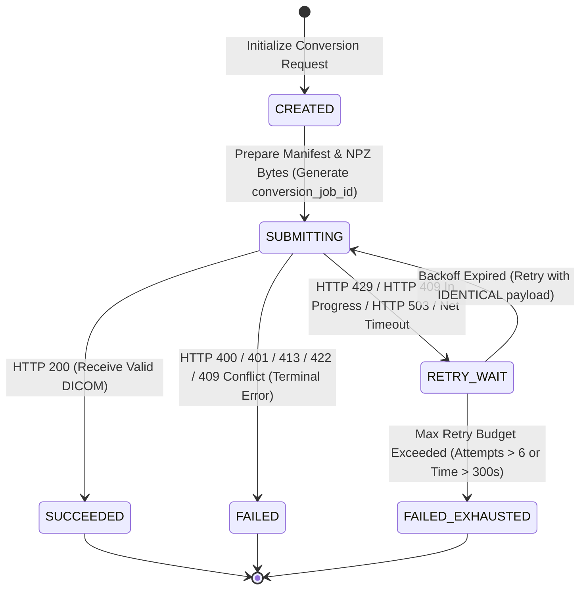

# MHCS INTEGRATION CONTRACT & IMPLEMENTATION GUIDE

**Repository:** [MPIPS](https://github.com/Madeena-software/mpips)  
**Target Consumer:** `mhcs-core` (Madeena Health Care Services)  
**API Surface:** Synchronous DICOM Conversion Endpoint (`POST /v1/radiographs/dicom`)  
**Contract Version:** 1.1  
**Baseline Commit SHA:** `cb58c662817e651363df43fe591d60d26ba5c741`  
**Document Status:** Authoritative Integration Contract  

---

## 1. Purpose

This document provides the authoritative integration contract for Madeena Health Care Services (MHCS) to safely, reliably, and correctly consume the MPIPS synchronous DICOM conversion API.

The objective is to provide complete, unambiguous technical specifications, schema definitions, failure handling logic, idempotency rules, and client pseudocode so that any developer or automated subagent working inside `mhcs-core` can implement the client library without reverse-engineering MPIPS source code.

> [!IMPORTANT]
> This contract applies strictly to the current synchronous v1 API surface (`POST /v1/radiographs/dicom`). MPIPS uses a **fail-fast admission control model** with concurrency bounded to 2. MPIPS does **not** maintain a server-side waiting queue. MHCS is responsible for client-side retry orchestration.

---

## 2. Architecture

```text
+-------------------------------------------------------------------------------+
|                                 MHCS SERVICE                                  |
|                                 (mhcs-core)                                   |
+-------------------------------------------------------------------------------+
                                       |
                                       | POST /v1/radiographs/dicom
                                       | Multipart: radiograph_npz, gain_npz, manifest
                                       | Header: X-MPIPS-API-Key
                                       v
+-------------------------------------------------------------------------------+
|                                 MPIPS API                                     |
|                        (Container: mpips-api:8000)                            |
|                                                                               |
|  1. Authenticate X-MPIPS-API-Key                                             |
|  2. Validate Upload Sizes (Manifest < 1MB, Rad < 100MB, Gain < 50MB)           |
|  3. Parse & Validate MHCSManifest JSON (Pydantic)                             |
|  4. Validate NPZ Byte Sizes & SHA-256 Hashes against Manifest                 |
|  5. Claim Redis Idempotency Lease (mpips:dicom_idempotency:...)               |
|  6. Acquire Process Concurrency Limiter (CapacityLimiter max=2)               |
+-------------------------------------------------------------------------------+
          |                                                       |
          | Capacity Available (Active < 2)                       | Capacity Exhausted (Active == 2)
          v                                                       v
+------------------------------------+                 +------------------------+
| ISOLATED WORKER PROCESS / CONTAINER|                 |  IMMEDIATE HTTP 429    |
| (mpips-npz-worker)                 |                 | CONCURRENCY_LIMIT_     |
|                                    |                 |       EXCEEDED         |
|  - Process arrays & calibration    |                 |  Header: Retry-After: 5 |
|  - Generate processed.tiff         |                 +------------------------+
|  - TOCTOU descriptor validation    |                            |
|  - Enrich DICOM & validate dataset |                            | Client-side bounded
|  - Return application/dicom (200)  |                            v retry (same job_id)
+------------------------------------+                 +------------------------+
                                                       |   MHCS CLIENT RETRY    |
                                                       | Exponential Backoff    |
                                                       | + Full Jitter          |
                                                       +------------------------+
```

### Private Internal Beta Deployment Topology
- **Production Container Endpoint (Internal Private Network):** `http://mpips-api:8000` on Docker network `madeena-software-network`.
- **Server-Local Host Verification Endpoint:** `http://127.0.0.1:8014` (published loopback port on simama production server).
- **Execution Isolation:** `mpips-api` spawns worker tasks via host supervisor Unix socket `/var/run/mpips/launcher.sock` into isolated container environments (`mpips-npz-worker`).
- **State Storage:** Redis (`redis://redis:6379/0`) manages idempotency leases and result tracking.

---

## 3. Endpoint Specification

| Attribute | Specification |
|---|---|
| **Protocol** | HTTP / 1.1 (TLS terminated at ingress/mesh layer) |
| **HTTP Method** | `POST` |
| **Path** | `/v1/radiographs/dicom` |
| **Full URL (Internal)** | `http://mpips-api:8000/v1/radiographs/dicom` |
| **Full URL (Host Verification)** | `http://127.0.0.1:8014/v1/radiographs/dicom` |
| **Request Content-Type** | `multipart/form-data` |
| **Success Response Content-Type** | `application/dicom` |
| **Error Response Content-Type** | `application/json` |

---

## 4. Authentication Contract

MPIPS requires a pre-shared API key sent in an HTTP request header.

- **Header Name:** `X-MPIPS-API-Key`
- **Header Format:** `X-MPIPS-API-Key: <secret_key_string>`
- **Environment Source (MPIPS):** Configured via `MPIPS_API_KEY` (or `API_KEY`).
- **Failure Behavior:** Missing, empty, or incorrect API keys immediately return `HTTP 401 Unauthorized`.

```json
{
  "detail": "INVALID_API_KEY"
}
```

> [!CAUTION]
> The API key is a sensitive secret. MHCS MUST load the API key from secure environment variables or vault secret storage. MHCS MUST NOT hardcode the key, log it in application logs, or include it in telemetry trace attributes.

---

## 5. Multipart Request Contract

The request body MUST be formatted as `multipart/form-data` containing exactly three form field attachments:

| Form Field Name | Required Data Type | Filename Convention | Max Allowed Size | Description |
|---|---|---|---|---|
| `radiograph_npz` | Binary file (`UploadFile`) | `radiograph.npz` | `100 MiB` (`104,857,600` B) | Compressed NumPy NPZ archive containing raw radiograph image array. |
| `gain_npz` | Binary file (`UploadFile`) | `gain.npz` | `100 MiB` (`104,857,600` B) | Compressed NumPy NPZ archive containing flat-field gain calibration array. |
| `manifest` | JSON file (`UploadFile`) | `manifest.json` | `100 MiB` (`104,857,600` B) | UTF-8 encoded JSON document conforming to `MHCSManifest` schema. |

### Global Upload Limits
- **Max Total Request Body Size:** `300 MiB` (`314,572,800` bytes via `MPIPS_DICOM_MAX_TOTAL_BYTES`, or `325,058,560` bytes HTTP body limit).
- Exceeding any individual field limit or total payload size returns `HTTP 413 Payload Too Large` with body `{"detail": "UPLOAD_SIZE_EXCEEDED"}`.

---

## 6. Manifest Schema (`MHCSManifest`)

The `manifest` field MUST be a valid JSON object strictly adhering to Pydantic schema version `1.0`. Extra fields are forbidden (`extra="forbid"`).

> [!WARNING]
> **SYNTHETIC MANIFEST SAFETY NOTICE:**  
> The provided example manifest (`mhcs-dicom-manifest.example.json`) is a **schema-valid synthetic manifest example**. Its `byte_size` and `sha256` fields are illustrative. Before submitting a real request, MHCS MUST calculate the exact byte size and SHA-256 hex digest of the raw NPZ files being uploaded, otherwise MPIPS will reject the request with `422 NPZ_VALIDATION_ERROR`.

### Root Object (`MHCSManifest`)

| Field | Type | Required | Ownership | Retry Stability | Description / Validation |
|---|---|---|---|---|---|
| `manifest_version` | String | Yes | MHCS | **STABLE** | Must be exactly `"1.0"`. |
| `conversion_job_id` | UUID (str) | Yes | MHCS | **STABLE** | Unique logical job ID. **MUST be preserved across all retries.** |
| `submission_id` | UUID (str) | Yes | MHCS | **STABLE** | Submission ID of the logical conversion. **MUST NOT be mutated per retry attempt.** |
| `correlation_id` | UUID (str) | Yes | MHCS | **STABLE** | Distributed tracing correlation ID. Returned in response header. |
| `examination` | Object | Yes | MHCS | **STABLE** | Examination & scheduling metadata (`ExaminationSchema`). |
| `patient` | Object | Yes | MHCS | **STABLE** | Patient demographic metadata (`PatientSchema`). |
| `operator` | Object | Yes | MHCS | **STABLE** | Radiographer/operator metadata (`OperatorSchema`). |
| `site` | Object | Yes | MHCS | **STABLE** | Imaging site & station metadata (`SiteSchema`). |
| `capture` | Object | Yes | MHCS | **STABLE** | Image capture technical metadata & file hashes (`CaptureSchema`). |
| `dicom` | Object | Yes | MHCS | **STABLE** | DICOM UIDs and target attributes (`DICOMManifestSchema`). |

---

### Nested Schema Details

#### `examination` (`ExaminationSchema`)
- `examination_id` (str, 1–64 chars): Unique examination ID in MHCS.
- `booking_id` (str, 1–64 chars): Appointment/booking identifier.
- `service_request_id` (str, 1–64 chars): Order/service request ID.
- `encounter_id` (str, 1–64 chars): Clinical encounter ID.
- `accession_number` (str, 1–16 chars): RIS/PACS Accession Number (DICOM `(0008,0050)`).
- `study_id` (str, 1–16 chars): Clinical Study ID (DICOM `(0020,0010)`).
- `performed_at` (datetime string): ISO 8601 timestamp with explicit timezone offset (e.g. `2026-08-12T14:30:00+07:00`). Must include timezone offset.
- `study_description` (str, 1–64 chars): Clinical study description (DICOM `(0008,1030)`).
- `protocol_name` (str, 1–64 chars): Imaging protocol name (DICOM `(0018,1030)`).

#### `patient` (`PatientSchema`)
- `member_id` (UUID string): Patient system member UUID.
- `medical_record_number` (str, 1–64 chars): Medical Record Number / Patient ID (DICOM `(0010,0020)`).
- `name` (`PersonNameSchema`):
  - `full_name` (str, 1–128 chars): Patient full name (DICOM `(0010,0010)`).
  - `family_name` (optional str, max 128 chars): Patient surname/family name.
- `sex` (str): Enum `["male", "female", "other", "unknown"]` (mapped to DICOM `(0010,0040)` `M`/`F`/`O`/`O`).
- `birth_date` (date string): Format `YYYY-MM-DD` (mapped to DICOM `(0010,0030)` `YYYYMMDD`).

#### `operator` (`OperatorSchema`)
- `operator_id` (str, 1–64 chars): Operator identifier.
- `name` (`PersonNameSchema`): Full name and optional family name of performing technologist (DICOM `(0008,1070)`).

#### `site` (`SiteSchema`)
- `organization_id` (str, 1–64 chars): Healthcare organization ID.
- `site_id` (str, 1–64 chars): Imaging facility/clinic site ID.
- `institution_name` (str, 1–64 chars): Institution Name (DICOM `(0008,0080)`).
- `department_name` (optional str, max 64 chars): Institutional Department Name (DICOM `(0008,1040)`).
- `station_name` (optional str, max 16 chars): Station Name / Workstation ID (DICOM `(0008,1010)`).
- `timezone` (str, 1–64 chars): IANA Timezone string (e.g., `"Asia/Jakarta"`).

#### `capture` (`CaptureSchema`)
- `capture_id` (str, 1–64 chars): Unique image capture identifier. Used to generate response file name (`<safe_capture_id>.dcm`).
- `protocol_version` (str, 1–64 chars): Hardware/software capture protocol version.
- `body_part_examined` (str, 1–16 chars): Body part examined (DICOM `(0018,0015)`, e.g., `"CHEST"`).
- `laterality` (str): Enum `["R", "L", "U", "B"]` (Right, Left, Unpaired, Both; DICOM `(0020,0060)`).
- `projection` (str, 1–16 chars): Projection view (e.g., `"PA"`, `"AP"`, `"LATERAL"`).
- `captured_at` (datetime string): Timestamp of exposure with explicit timezone offset.
- `radiograph` (`FileManifestSchema`):
  - `filename` (str, 1–128 chars): Original filename (`"radiograph.npz"`).
  - `byte_size` (int, > 0): Exact byte size of `radiograph_npz`.
  - `sha256` (str, 64 hex chars): Lowercase SHA-256 hex digest of `radiograph_npz`.
- `gain` (`GainManifestSchema`):
  - `filename` (str, 1–128 chars): Original filename (`"gain.npz"`).
  - `byte_size` (int, > 0): Exact byte size of `gain_npz`.
  - `sha256` (str, 64 hex chars): Lowercase SHA-256 hex digest of `gain_npz`.
  - `gain_id` (str, 1–64 chars): Detector gain map identifier.
- `image_spacing` (`ImageSpacingSchema`):
  - `row_um` (float, > 0.0): Row pixel spacing in micrometers ($\mu m$). Converted to mm in DICOM Imager Pixel Spacing `(0018,1164)`.
  - `column_um` (float, > 0.0): Column pixel spacing in micrometers ($\mu m$).

#### `dicom` (`DICOMManifestSchema`)
- `study_instance_uid` (str, max 64 chars): Valid DICOM UID (`regex: ^[0-9](\.[0-9]+)+$`). DICOM `(0020,000D)`.
- `series_instance_uid` (str, max 64 chars): Valid DICOM UID (`regex: ^[0-9](\.[0-9]+)+$`). DICOM `(0020,000E)`.
- `sop_instance_uid` (str, max 64 chars): Valid DICOM UID (`regex: ^[0-9](\.[0-9]+)+$`). DICOM `(0008,0018)`.
- `series_number` (int, > 0): Series number (DICOM `(0020,0011)`).
- `instance_number` (int, > 0): Instance/Image number (DICOM `(0020,0013)`).
- `series_description` (str, 1–64 chars): Series description (DICOM `(0008,103E)`).
- `presentation_intent` (str): Must be exactly `"FOR PRESENTATION"`.

---

## 7. Retry Identity & Payload Stability Contract

> [!CRITICAL]
> **FULL PAYLOAD STABILITY REQUIREMENT ON RETRY:**  
> The MPIPS Redis idempotency fingerprint (`fp`) is calculated from:
> $$\text{fp} = \text{SHA256}(\text{tenant\_id} + \text{manifest\_version} + \text{conversion\_job\_id} + \text{canonical\_manifest\_json} + \text{radiograph\_sha256} + \text{gain\_sha256})$$
>
> Because `canonical_manifest_json` includes the entire JSON payload, **mutating ANY field in the manifest between retries of the SAME logical request changes the fingerprint**.
>
> Changing `submission_id` or `correlation_id` on a retry will cause:
> 1. `HTTP 409 IDEMPOTENCY_CONFLICT` (if a previous attempt succeeded).
> 2. Re-claiming the job under a different fingerprint (if previous attempt failed/timed out), breaking execution idempotency.

### Retry Field Preservation Checklist
When retrying a transiently failed request (e.g. on HTTP 429, 503, timeout, or network drop), MHCS **MUST PRESERVE IDENTICAL VALUES** for:
- `conversion_job_id`
- `submission_id` (Do NOT increment or mutate per retry attempt; retry attempt numbers belong strictly in MHCS client logs/telemetry)
- `correlation_id`
- All `examination`, `patient`, `operator`, `site`, `capture`, and `dicom` metadata
- Exact `radiograph_npz` and `gain_npz` file bytes, byte sizes, and SHA-256 hex digests

A new `conversion_job_id` and new manifest identity should only be generated for a **genuinely new logical conversion attempt**.

---

## 8. File Integrity Contract

MPIPS streams and validates uploaded files against the manifest before initiating conversion:

1. **Size Verification:** `radiograph.npz` size must match `manifest.capture.radiograph.byte_size` exactly. `gain.npz` size must match `manifest.capture.gain.byte_size` exactly.
2. **SHA-256 Digest Verification:** MPIPS computes the streaming SHA-256 of `radiograph_npz` and `gain_npz`. The lower-case hex output must match `manifest.capture.radiograph.sha256` and `manifest.capture.gain.sha256` character-for-character.
3. **Validation Failure Response:** Mismatch in size or hash immediately aborts processing and returns `HTTP 422 Unprocessable Entity` with `{"detail": "NPZ_VALIDATION_ERROR"}`.

---

## 9. DICOM Identifier Ownership

- **Ownership:** MHCS owns the allocation and assignment of DICOM UIDs (`StudyInstanceUID`, `SeriesInstanceUID`, `SOPInstanceUID`), `SeriesNumber`, and `InstanceNumber`. MPIPS does **not** auto-generate or overwrite DICOM UIDs provided in the manifest.
- **Retry Rule:** For retries of the SAME conversion job, MHCS MUST preserve the identical `study_instance_uid`, `series_instance_uid`, and `sop_instance_uid`. Regenerating UIDs on retry breaks DICOM study structure and idempotency indexing in PACS.

---

## 10. Success Response Specification

When conversion succeeds, MPIPS returns a binary DICOM file.

- **HTTP Status Code:** `200 OK`
- **Content-Type:** `application/dicom`
- **Response Headers:**
  - `X-Correlation-ID`: `<uuid_string_from_manifest>`
  - `X-Conversion-Job-ID`: `<uuid_string_from_manifest>`
  - `Content-Disposition`: `attachment; filename="<safe_capture_id>.dcm"`
- **Response Body:** Binary PDU conforming to DICOM PS 3.10 standard (Explicit VR Little Endian, uncompressed 16-bit uint16 image array, zero private tags).

---

## 11. Error Contract

Error responses return structured JSON with an explicit error detail code:

```json
{
  "detail": "<ERROR_CODE_STRING>"
}
```

> [!NOTE]
> `HTTP 400 Bad Request` is framework-dependent (FastAPI / Starlette multipart parsing or missing request boundary) and does not promise a specific application detail string. MHCS should treat HTTP 400 as a terminal request-construction error.

### Complete Error Code Reference

| Status Code | Detail Code (`detail`) | Root Cause | Client Retryability |
|---|---|---|---|
| **400** | Framework dependent | Malformed multipart structure or invalid request boundary. | No (terminal error) |
| **401** | `INVALID_API_KEY` | Missing, empty, or mismatched `X-MPIPS-API-Key`. | No |
| **409** | `IDEMPOTENCY_IN_PROGRESS` | Another request with the same `conversion_job_id` is currently converting. | **Yes** (exponential backoff) |
| **409** | `IDEMPOTENCY_CONFLICT` | Payload/fingerprint mismatch for an existing `conversion_job_id`. | No (data error) |
| **413** | `UPLOAD_SIZE_EXCEEDED` | File size or total payload exceeded server limits. | No |
| **422** | `MANIFEST_SCHEMA_INVALID` | JSON manifest fails Pydantic schema validation. | No |
| **422** | `NPZ_VALIDATION_ERROR` | File size or SHA-256 hash does not match manifest. | No |
| **422** | `CALIBRATION_ARTIFACT_MISSING` | Required camera/detector calibration files missing on server. | No (server config issue) |
| **429** | `CONCURRENCY_LIMIT_EXCEEDED` | Concurrency limit (2) reached; fail-fast rejection. | **Yes** (backoff + jitter) |
| **503** | `IDEMPOTENCY_STORAGE_UNAVAILABLE` | Redis connection/storage failure during claim. | **Yes** (backoff + jitter) |
| **504** | `CONVERSION_TIMEOUT` | Worker conversion process exceeded processing timeout (300s). | **Yes** (bounded retry) |
| **500** | `CONVERSION_WORKER_FAILURE` | Internal worker crash, descriptor validation failure, or execution error. | Conditional (max 1 retry) |

---

## 12. Complete Error & Retry Matrix

| Status | Detail Code | Meaning | Retryable by MHCS? | Preserve Full Payload & `conversion_job_id`? | Recommended MHCS Action | Operator / Dev Action |
|---|---|---|---|---|---|---|
| `200` | None | Success | No | N/A | Store/forward DICOM file. | None. |
| `400` | Framework dep. | Malformed multipart | No | No | Surface integration bug. Do not retry. | Audit client HTTP multipart encoding. |
| `401` | `INVALID_API_KEY` | Authentication failure | No | No | Halt execution. Alert configuration. | Verify `MPIPS_API_KEY` secret configuration. |
| `409` | `IDEMPOTENCY_IN_PROGRESS` | Job already active | **Yes** | **YES** | Backoff and retry with IDENTICAL payload. | Monitor Redis lease TTL. |
| `409` | `IDEMPOTENCY_CONFLICT` | Payload mismatch | No | No | Terminal data error. Generate NEW job ID if payload changed. | Check MHCS job ID & payload generation logic. |
| `413` | `UPLOAD_SIZE_EXCEEDED` | Payload size limit exceeded | No | No | Reject capture at MHCS side. | Check NPZ file compression / sizing. |
| `422` | `MANIFEST_SCHEMA_INVALID` | Schema validation error | No | No | Fix JSON manifest formatting. | Verify schema against `MHCSManifest`. |
| `422` | `NPZ_VALIDATION_ERROR` | Byte/SHA-256 mismatch | No | No | Re-compute file byte size and SHA-256. | Audit manifest builder hash calculation. |
| `429` | `CONCURRENCY_LIMIT_EXCEEDED` | Transient backpressure | **Yes** | **YES** | **Apply exponential backoff with full jitter.** | Monitor MPIPS concurrency capacity. |
| `503` | `IDEMPOTENCY_STORAGE_...` | Redis unavailable | **Yes** | **YES** | Apply exponential backoff. Retry. | Check Redis cluster health. |
| `504` | `CONVERSION_TIMEOUT` | Process timed out (>300s) | **Yes** | **YES** | Bounded retry after timeout window. | Check worker container CPU/memory limits. |
| `Net Err` | N/A | Socket/HTTP timeout | **Yes** | **YES** | Retry request with IDENTICAL payload. | Inspect ingress network connectivity. |

---

## 13. Proposed MHCS 429 Retry Policy (`PROPOSED_MHCS_RETRY_POLICY`)

### Distinction: Current Server Behavior vs. Proposed Client Policy
- `CURRENT_MPIPS_SERVER_BEHAVIOR`: MPIPS returns `Retry-After: 5` header on HTTP 429.
- `PROPOSED_MHCS_RETRY_POLICY`: Because production conversions take 85–105 seconds, MHCS **MUST NOT** blindly retry every 5 seconds indefinitely. MHCS SHOULD implement exponential backoff with full jitter where the actual delay is **guaranteed to be $\ge \text{Retry-After}$**.

```text
PROPOSED MHCS Backoff Formula:
  Base Floor = max(5.0, float(Retry-After header))
  Backoff Range = min(60.0, 5.0 * (2 ^ (attempt - 1)))
  Actual Delay = Base Floor + random_uniform(0, Backoff Range)
```

### Proposed Retry Schedule Progression Example

| Attempt | Base Floor | Added Jitter Range | Total Sleep Range |
|---|---|---|---|
| **Attempt 1** | Immediate (0s) | 0s | 0s |
| **Attempt 2 (429)** | 5.0s | 0.0s – 5.0s | **5.0s – 10.0s** (e.g. ~7.5s) |
| **Attempt 3 (429)** | 5.0s | 0.0s – 10.0s | **5.0s – 15.0s** (e.g. ~10.0s) |
| **Attempt 4 (429)** | 5.0s | 0.0s – 20.0s | **5.0s – 25.0s** (e.g. ~15.0s) |
| **Attempt 5 (429)** | 5.0s | 0.0s – 40.0s | **5.0s – 45.0s** (e.g. ~25.0s) |
| **Attempt 6 (429)** | 5.0s | 0.0s – 60.0s (cap) | **5.0s – 65.0s** (e.g. ~35.0s) |

---

## 14. HTTP Timeout Guidance & Infrastructure Boundaries

| Level | Control Variable / Setting | Value | Rationale |
|---|---|---|---|
| **MPIPS Worker Timeout** | `MPIPS_DICOM_PROCESS_TIMEOUT_SECONDS` | `300s` | Configured maximum time allowed for isolated NPZ worker conversion. |
| **Reverse Proxy / Gateway** | Nginx / Traefik / Mesh Timeout | Proposed `330s – 360s` | Buffer beyond worker timeout to allow response serialization. |
| **MHCS HTTP Client Timeout** | `MHCS_MPIPS_HTTP_TIMEOUT` | `MHCS_HTTP_TIMEOUT_UNKNOWN=true` | Proposed starting recommendation: `330s – 360s`. Must be confirmed in `mhcs-core`. |
| **Measured Conversion Time** | Internal Beta Benchmark | `85s – 105s` | Measured p50 single/concurrency=2 conversion duration. |

> [!IMPORTANT]
> `MHCS_HTTP_TIMEOUT_UNKNOWN=true`: The exact default HTTP client timeout in `mhcs-core` is currently unconfirmed in repository context. The MHCS HTTP timeout, reverse-proxy timeout, maximum retry attempts, and total retry budget MUST be explicitly confirmed in `mhcs-core` client/infrastructure configuration.

---

## 15. Concurrency & Fail-Fast Backpressure Contract

- **Configured Server Concurrency:** `MPIPS_DICOM_MAX_CONCURRENT_CONVERSIONS=2`.
- **Server Behavior:** When 2 conversions are actively processing, any incoming 3rd simultaneous request receives an immediate `HTTP 429 CONCURRENCY_LIMIT_EXCEEDED` response.
- **Contract Interpretation:** MHCS MUST interpret HTTP 429 as **transient capacity backpressure**, NOT a conversion failure or corrupted radiograph.

---

## 16. Idempotency Mechanics & `SUCCEEDED_SAME` Semantics

MPIPS implements atomic Redis-backed idempotency using a 64-character SHA-256 payload fingerprint.

### Redis Claim States (`CLAIM_LUA`) & Conversion Route Execution
1. `CLAIMED`: First execution attempt or retry of a previously failed attempt with the **same** fingerprint. MPIPS issues a lease token and begins conversion.
2. `IN_PROGRESS`: Job with the same `conversion_job_id` is currently converting in another process. MPIPS returns `HTTP 409 IDEMPOTENCY_IN_PROGRESS`.
3. `SUCCEEDED_SAME`: Job with the same `conversion_job_id` and **identical fingerprint** previously completed successfully.
4. `SUCCEEDED_DIFF`: Job with the same `conversion_job_id` exists, but payload fingerprint **differs**. MPIPS returns `HTTP 409 IDEMPOTENCY_CONFLICT`.

> [!WARNING]
> **`SUCCEEDED_SAME` DOES NOT RETURN A CACHED DICOM BINARY FROM REDIS:**  
> Redis stores idempotency state and `cached_uids` metadata, **NOT the completed DICOM response binary**.  
> If an identical request is re-submitted after completion (`SUCCEEDED_SAME`), MPIPS issues a lease token and re-executes conversion to produce and return the DICOM file. MPIPS does not return a cached DICOM binary from Redis.

---

## 17. Network Timeout / 504 Semantics & Result Retrieval Limitations

If MHCS times out or experiences a network disconnect while MPIPS is converting:
1. **Transient In-Progress State:** Retrying the request immediately may return `HTTP 409 IDEMPOTENCY_IN_PROGRESS` if the server worker is still active. MHCS should preserve the identical payload, back off, and retry.
2. **Result Retrieval Limitation:** The current synchronous v1 API has **no independent result-retrieval endpoint** (e.g. `GET /v1/radiographs/dicom/{job_id}`). If the HTTP 200 response was lost in transit after server completion, retrying the request with identical payload will re-execute conversion (`SUCCEEDED_SAME`) to re-generate the DICOM file.

---

## 18. Observability Contract

MHCS MUST log structured operational events for all MPIPS API calls.

### Allowed & Recommended Log Attributes
- `conversion_job_id` (UUID)
- `correlation_id` (UUID)
- `submission_id` (UUID)
- `http_status_code` (int)
- `mpips_error_code` (str, e.g. `"CONCURRENCY_LIMIT_EXCEEDED"`)
- `attempt_number` (int)
- `request_duration_ms` (float)
- `cumulative_retry_elapsed_s` (float)

### Prohibited Log Attributes (PHI & Security Boundary)
- `X-MPIPS-API-Key` (API Key Header)
- Raw radiograph / gain NPZ array contents
- Binary DICOM payload bytes
- Patient name, NIK, or birth date in log messages

---

## 19. Retry Observability & Alerting

MHCS SHOULD track retry metrics to distinguish transient capacity backpressure from persistent server failures.

```text
Log Event Format:
[WARN] MPIPS API Backpressure Received | job_id=a1b2c3d4... | status=429 | attempt=2/6 | backoff_delay=7.5s | cumulative_elapsed=7.5s
```

### Recommended Operations Alerting Thresholds
- **Warning Alert:** Cumulative retries for a single job > 3 attempts.
- **Critical Alert:** Retry budget exhausted (`MAX_ATTEMPTS` reached) or repeated `HTTP 503` / `HTTP 504` errors over a 5-minute window.

---

## 20. Client-Side Backpressure Optimization (Optional Future Optimization)

To minimize unnecessary HTTP 429 round-trips, `mhcs-core` MAY implement client-side concurrency control:

- **Local Semaphore:** Limit concurrent outbound requests to `MPIPS` to 2 per MPIPS instance.
- **Dispatch Queue:** Buffer outbound conversions in an internal MHCS worker queue when local concurrency is saturated.

---

## 21. Integration Failure Scenarios & MHCS Handling

| Scenario | Server Response | MHCS Expected Handling |
|---|---|---|
| **1. Invalid API Key** | `401 INVALID_API_KEY` | Abort immediately. Log error. Alert operator. |
| **2. Malformed Manifest** | `422 MANIFEST_SCHEMA_INVALID` | Abort immediately. Log schema validation details. |
| **3. SHA-256 Mismatch** | `422 NPZ_VALIDATION_ERROR` | Abort immediately. Re-read source NPZ files. |
| **4. Oversized File** | `413 UPLOAD_SIZE_EXCEEDED` | Abort immediately. Reject image payload at MHCS API. |
| **5. Job In Progress** | `409 IDEMPOTENCY_IN_PROGRESS` | Wait with IDENTICAL payload. Retry. |
| **6. Payload Conflict** | `409 IDEMPOTENCY_CONFLICT` | Abort immediately. Log job ID / payload collision. |
| **7. Server Capacity Full** | `429 CONCURRENCY_LIMIT_EXCEEDED` | **Apply exponential backoff + jitter. Retry with IDENTICAL payload.** |
| **8. Redis Unavailable** | `503 IDEMPOTENCY_STORAGE_...` | Apply exponential backoff + jitter. Retry with IDENTICAL payload. |
| **9. Worker Timeout** | `504 CONVERSION_TIMEOUT` | Wait > 30s. Retry with IDENTICAL payload. |
| **10. Network Drop** | Socket Timeout / Reset | Retry request with IDENTICAL payload. |
| **11. Client Timeout** | HTTP Client Timeout | Retry request with IDENTICAL payload. |
| **12. Corrupted DICOM** | 200 OK (invalid DICOM bytes) | Treat as `500`. Log error. Surface bug report. |
| **13. Successful DICOM** | 200 OK (valid DICOM bytes) | Store DICOM to PACS/S3. Complete job. |

---

## 22. Success Response Validation

Upon receiving `HTTP 200 OK`, MHCS client MUST validate:

1. `Content-Type` header equals `application/dicom`.
2. Response headers `X-Correlation-ID` and `X-Conversion-Job-ID` match request manifest.
3. Response body is non-empty binary data starting with DICOM preamble (128 zero bytes followed by `DICM` magic bytes at offset 128).
4. DICOM dataset parses cleanly via DICOM parser (e.g. `pydicom.dcmread`).

---

## 23. Integration State Machine



---

## 24. Document Future Async Migration (Non-Normative)

> [!NOTE]
> The following describes a potential future asynchronous job model. **IT IS NOT IMPLEMENTED IN THE CURRENT V1 API.**

```text
Future Asynchronous API Sketch (NOT CURRENT BEHAVIOR):
  POST /v1/radiographs/jobs -> 202 Accepted {"job_id": "...", "status": "queued"}
  GET  /v1/radiographs/jobs/{job_id} -> 200 OK {"status": "processing" | "succeeded" | "failed"}
  GET  /v1/radiographs/jobs/{job_id}/result -> 200 OK (application/dicom)
```

---

## 25. Request Example (`curl`)

```bash
#!/usr/bin/env bash
set -euo pipefail

# Configuration
MPIPS_BASE_URL="${MPIPS_BASE_URL:-http://127.0.0.1:8014}"
MPIPS_API_KEY="${MPIPS_API_KEY:-mpips_dev_key_synthetic_only}"

RADIOGRAPH_PATH="./radiograph.npz"
GAIN_PATH="./gain.npz"
MANIFEST_PATH="./manifest.json"
OUTPUT_DICOM_PATH="./output.dcm"

curl --fail \
  --request POST \
  --url "${MPIPS_BASE_URL}/v1/radiographs/dicom" \
  --header "X-MPIPS-API-Key: ${MPIPS_API_KEY}" \
  --form "radiograph_npz=@${RADIOGRAPH_PATH};type=application/octet-stream" \
  --form "gain_npz=@${GAIN_PATH};type=application/octet-stream" \
  --form "manifest=@${MANIFEST_PATH};type=application/json" \
  --output "${OUTPUT_DICOM_PATH}" \
  --verbose

echo "DICOM conversion completed successfully: ${OUTPUT_DICOM_PATH}"
```

---

## 26. MHCS Client Implementation Pseudocode

```python
import time
import random
import uuid
import json
import requests

class MPIPSClientError(Exception): pass
class MPIPSTerminalError(MPIPSClientError): pass
class MPIPSRetryExhaustedError(MPIPSClientError): pass

class MHCSMPIPSClient:
    def __init__(self, base_url: str, api_key: str, timeout_seconds: float = 330.0):
        self.base_url = base_url.rstrip('/')
        self.api_key = api_key
        self.timeout_seconds = timeout_seconds

    def convert_radiograph(
        self,
        radiograph_bytes: bytes,
        gain_bytes: bytes,
        manifest_dict: dict,
        max_attempts: int = 6,
        max_elapsed_seconds: float = 300.0
    ) -> bytes:
        # Enforce full payload preservation across retries
        conversion_job_id = str(manifest_dict["conversion_job_id"])
        manifest_json_str = json.dumps(manifest_dict)
        url = f"{self.base_url}/v1/radiographs/dicom"
        headers = {"X-MPIPS-API-Key": self.api_key}

        start_time = time.time()
        attempt = 0

        while attempt < max_attempts:
            attempt += 1
            elapsed = time.time() - start_time
            if elapsed >= max_elapsed_seconds:
                raise MPIPSRetryExhaustedError(f"Retry budget time limit ({max_elapsed_seconds}s) exceeded.")

            files = {
                "radiograph_npz": ("radiograph.npz", radiograph_bytes, "application/octet-stream"),
                "gain_npz": ("gain.npz", gain_bytes, "application/octet-stream"),
                "manifest": ("manifest.json", manifest_json_str, "application/json"),
            }

            try:
                response = requests.post(url, headers=headers, files=files, timeout=self.timeout_seconds)
                
                # 200 OK: Success
                if response.status_code == 200:
                    return response.content

                # Terminal Error Codes
                if response.status_code in (400, 401, 413, 422):
                    detail = response.json().get("detail", "UNKNOWN_ERROR")
                    raise MPIPSTerminalError(f"Terminal failure HTTP {response.status_code}: {detail}")

                if response.status_code == 409:
                    detail = response.json().get("detail", "")
                    if detail == "IDEMPOTENCY_CONFLICT":
                        raise MPIPSTerminalError("Idempotency conflict: payload mismatch for job_id.")
                    # IDEMPOTENCY_IN_PROGRESS -> Retryable with IDENTICAL payload

                # 429 Concurrency Limit Exceeded or Retryable Server Errors (503, 504)
                if response.status_code in (429, 409, 503, 504):
                    retry_after = float(response.headers.get("Retry-After", 5.0))
                    base_floor = max(5.0, retry_after)
                    backoff_range = min(60.0, 5.0 * (2 ** (attempt - 1)))
                    actual_sleep = base_floor + random.uniform(0, backoff_range)
                    time.sleep(actual_sleep)
                    continue

                raise MPIPSTerminalError(f"Unexpected status code HTTP {response.status_code}")

            except (requests.Timeout, requests.ConnectionError) as net_err:
                # Network ambiguity -> Retry with IDENTICAL payload
                base_floor = 5.0
                backoff_range = min(60.0, 5.0 * (2 ** (attempt - 1)))
                actual_sleep = base_floor + random.uniform(0, backoff_range)
                time.sleep(actual_sleep)
                continue

        raise MPIPSRetryExhaustedError(f"Maximum attempt limit ({max_attempts}) reached for job {conversion_job_id}.")
```

---

## 27. Operational Performance Notes (Internal-Beta Observations)

*Source: Production Benchmark Run ID `31572779655`, Commit `7acf893cf98ba6be89e371aaf3c023dcfae831ff` on `simama-production-server`.*

- **Sequential Processing Latency:** $p50 \approx 85\text{ seconds}$ per radiograph conversion.
- **Concurrency=2 Latency:** $p50 \approx 101\text{ seconds}$ per conversion under two parallel jobs.
- **Burst Behavior (8 Simultaneous Requests):**
  - Admitted: `2` requests processed (HTTP 200).
  - Rejected: `6` requests rejected immediately (HTTP 429).
  - Unexpected 5xx Errors: `0`.
- **Resource Constraints:** Worker process memory reaches $\sim 2\text{ GiB}$ container limit (`MPIPS_DICOM_WORKER_MEMORY_BYTES=2147483648`). API service container memory limit is $1\text{ GiB}$. Host retains ample memory headroom.

> [!NOTE]
> These measurements document internal-beta test observations on benchmark hardware. They do NOT represent a formal production Service Level Agreement (SLA).

---

## 28. Security Requirements & Residual Risks

1. **Network Boundary:** `mpips-api` MUST run strictly inside private networks (`madeena-software-network`). Public exposure is prohibited.
2. **Secret Management:** `MPIPS_API_KEY` MUST be managed via secure environment files or vault solutions.
3. **Data Protection:** Temporary processing files in `/tmp/mpips-workspaces` are created with strict `0700` directory permissions and `0400`/`0600` file permissions, cleaned up immediately upon completion.
4. **PHI Isolation:** Raw pixel data and patient identifiers MUST NOT be emitted into application logs or metric tags.

### Residual Risks
1. **`NPZ_UNTRUSTED_INPUT_SECURITY_POSTURE=OPEN`:** `mpips/workflows/imager_pipeline/npz_io.py` loads NPZ files using `np.load(path, allow_pickle=True)`. Process/container isolation (`mpips-npz-worker`) reduces host blast radius, but `allow_pickle=True` still permits pickle/object-array deserialization inside the worker process if untrusted NPZ files are submitted.
2. **Small Performance Sample Size:** Benchmark evidence is based on internal-beta test fixtures; real-world clinical throughput may vary under different image matrix sizes.
3. **Worker Memory Limits:** High-resolution NPZ inputs (> 4000x4000) push worker memory usage close to the 2 GiB container memory limit.
4. **Retry-After Header vs. Conversion Time:** Server returns `Retry-After: 5` while conversions take ~100s. Client must use exponential backoff rather than naive 5-second polling.
5. **Unconfirmed MHCS Default Timeout (`MHCS_HTTP_TIMEOUT_UNKNOWN=true`):** MHCS HTTP client configuration must be verified to ensure timeouts are $\ge 330\text{ seconds}$.
6. **CI Action Warnings:** GitHub Actions Node.js 20 runtime deprecation warnings are present in upstream workflow runners.

---

## 29. Integration Verification Checklist

- [ ] `mhcs-core` client sets `X-MPIPS-API-Key` header from secure configuration.
- [ ] Multipart upload includes `radiograph_npz`, `gain_npz`, and `manifest` form fields.
- [ ] Manifest conforms to `MHCSManifest` JSON schema v1.0.
- [ ] Client computes exact byte sizes and lowercase SHA-256 hex hashes from source NPZ bytes before submission.
- [ ] Client preserves the IDENTICAL payload (`conversion_job_id`, `submission_id`, metadata, NPZ hashes) across retries.
- [ ] Client implements exponential backoff with full jitter guarantees ($\text{sleep} \ge \text{Retry-After}$) for HTTP 429, 409 (in progress), 503, and network timeouts.
- [ ] Client HTTP timeout and reverse-proxy timeouts are confirmed and configured ($\ge 330$ seconds).
- [ ] Client validates HTTP 200 response headers and DICOM file structure.
